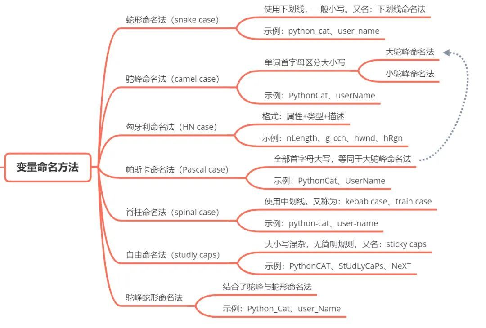

## Python 为什么要推荐蛇形命名法？

首先一点，对于单个字符或者单词（例如：a、A、PYTHON、Cat），当它们被用作变量名时，大致有全小写、全大写和首字母大写这几种情况。编程语言中出现这些情况时，它们基本上跟英语的表达习惯是相同的。

但是，编程语言为了令变量名表达出更丰富的含义，通常需要使用多个单词或符号。英语习惯使用空格来间隔开单词，然而这种用法在编程语言中会带来一些麻烦，所以程序员们就创造出了另外的方法：

- 蛇形命名法（snake case）
- 驼峰命名法（camel case）
- 匈牙利命名法（HN case）
- 帕斯卡命名法（Pascal case）
- 脊柱命名法（spinal case）
- 自由命名法（studly caps）
- 驼峰蛇形命名法

总体而言，这些命名法都是要克服单词间的空格，从而把不同单词串连起来，最终达到创造出一种新的“单词”的效果。

## 文档信息
---
- 版权声明：自由转载-非商用-非衍生-保持署名（[创意共享3.0许可证](https://creativecommons.org/licenses/by-nc-nd/3.0/deed.zh)）
- 发表日期： 2022-09-01T18:13:56+08:00
